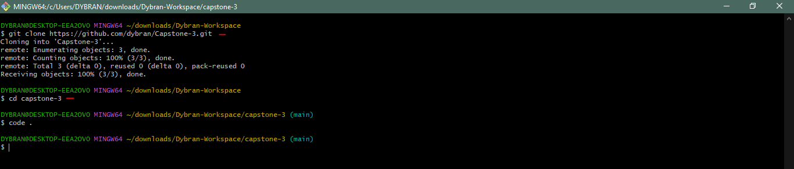

## CAPSTONE PROJECT - CONTAINERIZATION AND CONTAINER ORCHESTRATION

In this project, I will be containerising a simple website for a company's landing page. This application will be containerised using docker, deployed to kubernetes cluster and accessd using nginx.

__TASK__:

Create a new project directory called __capstone-3__  in your repository.

Clone into the directory.

you can use the command `code . + Enter` to open the directory in vscode.



In the directory, create the website for deployment - Use ChatGPT to generate a basic HTML (index.html) and CSS file (styles.css).
 and create these files in the folderr


 Add the initial code to the git repository

 `$ git add .`

 `$ git commit -m "<commit-message>"`

 `$ git push`

 

Create a __Dockerfile__ for the application - specify nginx as the base image and copy __index.html__ and the __styles.css__ into the Nginx HTML directory.

```
# Use NGINX as the base image
FROM nginx

# Set working directory within the NGINX HTML directory
WORKDIR /usr/share/nginx/html

# Copy the HTML and CSS files into the container's HTML directory
COPY index.html .
COPY styles.css .

# Expose port 80 for NGINX
EXPOSE 80
```
Breakdown of the above

This Dockerfile sets up a Docker image based on NGINX, a popular web server.

1. `FROM nginx`: This line specifies that we are using the official NGINX Docker image as the base image for our container. This means that our container will include all the necessary files and configurations to run NGINX.

2. `WORKDIR /usr/share/nginx/html`: This command sets the working directory within the NGINX container to `/usr/share/nginx/html`. This directory is typically where NGINX serves static HTML files from.

3. `COPY index.html .`: This line copies the `index.html` file from the build context (the directory where the Dockerfile is located) into the `/usr/share/nginx/html` directory within the container. The `.` after `index.html` means "copy it to the current directory," which in this case is `/usr/share/nginx/html`.

4. `COPY styles.css .`: Similarly, this line copies the `styles.css` file from the build context into the `/usr/share/nginx/html` directory within the container.

5. `EXPOSE 80`: This command exposes port 80 on the container. Port 80 is the default port for HTTP traffic, so by exposing it, we allow external clients to access our NGINX server running inside the container.

Overall, this Dockerfile is setting up a basic NGINX server with custom HTML (`index.html`) and CSS (`styles.css`) files served from the `/usr/share/nginx/html` directory, and it exposes port 80 to allow external access to the NGINX server.

Create the image- ensuring you have Docker Desktop installed. If you are working on an EC2 instance, ensure Docker is installed on it. In my scenario, I am using my local machine, so I initiate Docker Desktop.


Then build the image

`$ docker build -t capstone-3 .`


Verify the image

`$ docker images`


Log into your dockerhub account and create a repository i.e __capstone-3__


The image needs to be tagged with the repository's name. Therefore, we need to retag the image using the repository name created on DockerHub.

`$ docker tag capstone-3:latest dybran/capstone-3:latest`


Log into your dockerhub using your username and password.

`$ docker login`


Push the image to the dockerhub

`$ docker push dybran/capstone-3:latest`


Verify on dockerhub


__DEPLOY IMAGE TO KUBERNETES CLUSTER__

Setup __Kind cluster__.

- __Install Docker Desktop__:
   - Kind runs Kubernetes clusters in Docker containers, so you need Docker Desktop installed on your Windows machine.

- __Enable Kubernetes in Docker Desktop__:
   - After installing Docker Desktop, open it and go to Settings.
   - Navigate to the Kubernetes tab and check the box to enable Kubernetes. Click Apply and wait for Docker Desktop to set up Kubernetes.

- __Install Chocolatey__:
   - Chocolatey is a package manager for Windows that can simplify the installation of various tools, including Kind.
   - You can install Chocolatey by following the instructions on the official Chocolatey website: [Install Chocolatey](https://chocolatey.org/install)

- __Install Kind__:
   - You can install Kind using Chocolatey or by downloading the binary from the GitHub releases page.
   - To install via Chocolatey, open PowerShell as an administrator and run:

    `choco install kind`

    

   - To verify that kind installation, run the command
   
   `kind version`

   

- __Create a Kind Cluster__:

Create a directory __capstone-kind__

`cd` into the directory

Run the command to create a Kind cluster:
    
`kind create cluster`
    
- This command will create a single-node Kubernetes cluster using Kind.


- __Verify Cluster__:
   - After the cluster creation process is complete, you can verify that the cluster is running by executing:

`kubectl cluster-info`


Configure __kubectl__ to point to the kind cluster

`kubectl cluster-info --context kind-kind`


`kubectl get nodes`


Create Deployment YAML File - Write a Kubernetes Deployment configuration in a YAML file. This file describes the desired state for your application pods.

Create a file __deplyment.yaml__ and paste the code snippet below

```
apiVersion: apps/v1
kind: Deployment
metadata:
  name: capstone3-app
spec:
  replicas: 1
  selector:
    matchLabels:
      app: capstone3-app
  template:
    metadata:
      labels:
        app: capstone3-app
    spec:
      containers:
      - name: capstone3-app-container
        image: dybran/capstone-3:latest
        ports:
        - containerPort: 80
```

This YAML configuration defines a Kubernetes Deployment named "capstone3-app" that manages a single replica of a containerized application. Let's break it down:

- `apiVersion: apps/v1`: This specifies the API version being used. In this case, it's `apps/v1`, which is commonly used for managing higher-level abstractions like Deployments, StatefulSets, and DaemonSets.

- `kind: Deployment`: Defines the type of Kubernetes resource being created, which is a Deployment. A Deployment manages a set of identical pods, ensuring that a specified number of them are running at any given time.

- `metadata`: Contains metadata about the Deployment, such as its name.

  - `name: capstone3-app`: The name of the Deployment.

- `spec`: Describes the desired state of the Deployment, including how many replicas of the application should be running and how to define the pods.

  - `replicas: 1`: Specifies that there should be one replica of the application running. Kubernetes will ensure that this many instances of the application are running at all times.

  - `selector`: Defines how the Deployment selects which pods to manage.

    - `matchLabels`: Specifies that the Deployment should manage pods with the label `app: capstone3-app`.

  - `template`: Specifies the pod template that Kubernetes will use to create new pods.

    - `metadata`: Contains metadata for the pods created from this template.

      - `labels`: Specifies the labels to be applied to the pods. In this case, the label `app: capstone3-app` is applied.

    - `spec`: Specifies the specification for the containers within the pod.

      - `containers`: Describes the containers that should be run in the pod.

        - `name: capstone3-app-container`: The name of the container.

        - `image: dybran/capstone-3:latest`: Specifies the Docker image to use for the container. The image `dybran/capstone-3` is being used with the `latest` tag, indicating the latest version of the image - __This is the image we pushed to the dockerhub__.

        - `ports`: Specifies the ports to expose on the container.

          - `containerPort: 80`: Specifies that port 80 within the container should be exposed. This allows traffic to reach the application running inside the container.


Create Service YAML File - Write your Kubernetes Service configuration in a YAML file. This file exposes your application to network traffic.

Create a file __service.yaml__ and paste the code snippet below.

```
apiVersion: v1
kind: Service
metadata:
  name: capstone3-app-service
spec:
  selector:
    app: castone3-app
  ports:
    - protocol: TCP
      port: 80
      targetPort: 80
```

This YAML snippet defines a Kubernetes Service object, which acts as an abstraction layer to expose a set of Pods (a group of one or more containers) as a network service. Let's break it down:

- `apiVersion: v1`: Specifies the Kubernetes API version being used. In this case, it's version 1.

- `kind: Service`: Indicates the kind of Kubernetes object being defined, which is a Service in this case.

- `metadata`: Contains metadata about the Service, such as its name.

  - `name: capstone3-app-service`: Specifies the name of the Service, which is "capstone3-app-service".

- `spec`: Specifies the desired state of the Service.

  - `selector`: Defines how the Service selects which Pods to target. In this case, it selects Pods with the label `app` set to `castone3-app`.

  - `ports`: Specifies the ports that the Service will listen on and forward traffic to.

    - `- protocol: TCP`: Indicates that the Service will use the TCP protocol.

    - `port: 80`: Specifies the port on which the Service will listen for incoming traffic.

    - `targetPort: 80`: Specifies the port to which the incoming traffic will be forwarded to within the Pods selected by the `selector`. In this case, traffic will be forwarded to port 80 of the Pods.


Apply the Deployment and Service YAML files using the following commands:

`kubectl apply -f deployment.yaml`

`kubectl apply -f service.yaml`


__Verify Deployment and Service__ - After applying the YAML files, you can verify that the resources have been created successfully by running:

`kubectl get deployments`

`kubectl get service`


Port Forwarding:

Once you have identified the pod, you can use the kubectl port-forward command to forward a local port to a port on the pod.

`kubectl port-forward <pod-name> <local-port>:<pod-port>`

Replace `<pod-name>` with the name of your pod, `<local-port>` with the port on your local machine you want to use to access the application, and `<pod-port>` with the port your application is listening on within the pod.

`kubectl port-forward capstone3-app-6f87ff478c-wx2b5 8089:80`


Access the website through your browser on port __8089__

`localhost:8089`


We have successfully deployed a container to Kind kubernetes cluster.


__Clean Up__

To stop __port-forwarding__ use 

`ctrl + c`

To delete cluster run

`kind delete cluster`

