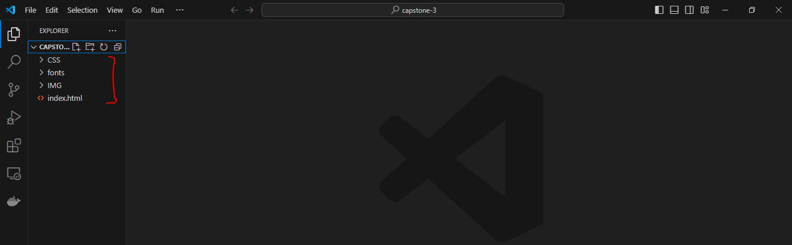

## CAPSTONE PROJECT - CONTAINERIZATION AND CONTAINER ORCHESTRATION

In this project, I will be containerising a simple website for a company's landing page. This application will be containerised using docker, deployed to kubernetes cluster and accessd using nginx.

__TASK__:

- _Task 1_

Create a new project directory called __capstone-3__.

In the directory, create the website for deployment. You have the option to deploy an existing website or utilize ChatGPT to generate a basic HTML and CSS file.

 Add the initial code to the git repository

